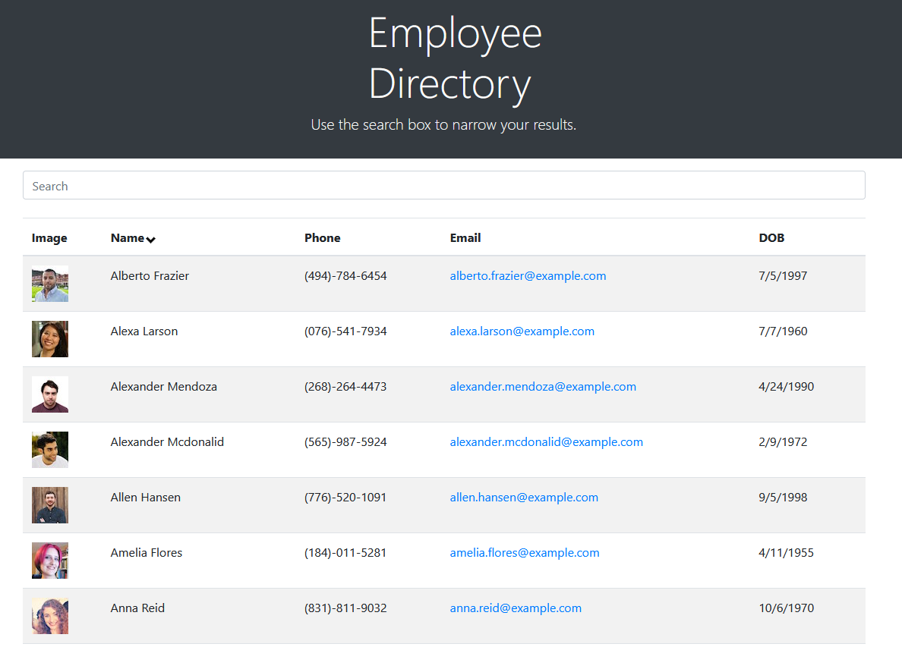

# Selma's HW12 Employee Tracker

## Description:

In this activity, I am utilizing the inquirer node package to build an easy terminal interfaced employee management system that is linked to a SQL database. The user can view all employees, departments, and roles in the company. In addition to this, the user can add information to any of these tables in a very simple way. The interface is so easy, that a user would not need to access the database in order to make changes. I did this through the use of 'connection.query' functions and utilized asynchronous callbacks to write and return promises.

## A couple of things I learned in this:

- I learned that asynchronous functions can get pretty messy when they are nested within each other. It's better to deal with them one at a time (at least in my beginner phase).
- I learned about console.table to display the information in the database to my end user.
- I could not figure out how to prevent the user from entering a role ID that did not exist in the database.

## Installation:

- If you need to pull my code for this homework, please visit my Github repository at: https://github.com/selma-e/Employee_Tracker
- If you want to see the code in action, please view the video here: https://docusign.zoom.us/rec/share/lCJXtJIp83IXHC2tgxrtaqHlZWXZlSrjWhaBsBd5MtJoFbN4G8C0YU4_hwybTo6S.HDs9U9iSpxIy3NrA?startTime=1612506455000

## Usage:

## Resources Used/Credits:

- https://developer.mozilla.org/en-US/docs/Web/API/Console/table
- https://www.npmjs.com/package/inquirer
- https://www.digitalocean.com/community/tutorials/4-uses-of-javascripts-arraymap-you-should-know

© 2021 Selma Elgabalawy | UW-SEA-FSF-PT-08-2020-U-C-TTh
